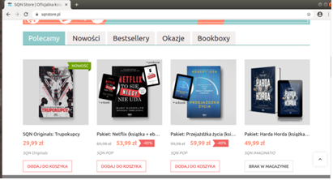

## mini-Projekt Selenium Webdriver WSB

Projekt przygotowany po zajęciach z testowania z Selenium (Studia podyplomowe WSB we Wrocławiu, kierunek "tester oprogramowania dla aplikacji mobilnych i serwerowych")

Przygotowanie środowiska wirtualnego:
```
$ python3 -m venv .venv
$ source .venv/bin/activate
$ pip install -r requirements.txt
```

Pobranie sterowników do Chrome:
https://chromedriver.chromium.org/downloads

Testy przeprowadzone na stronie [SQNStore.pl](https://sqnstore.pl/)

- Pierwszy test

   Rejestracja użytkownika przy wpisaniu nieprawidłowego adresu e-email

   [opis i kroki](./sqn-test-rejestracja.txt)
```
uruchomienie testu:
python3 sqn_test_rejestracja.py
```
- Drugi test

  Dodanie do koszyka z poziomu strony głównej produktu dostępnego i niedostępnego w magazynie

  

  [opis i kroki](./sqn-test-koszyk.txt)

  Test bardzo wrażliwy na zmiany struktury strony (w momencie dodawania do repozytorium brak na stronie gównej produktów niedostępnych)
```
uruchomienie testu:
python3 sqn_test_koszyk.py
```
